# Робота із API Google stylesheet.
Для початку роботи із Google Stylesheet треба зареєструватися в <a href = "https://console.cloud.google.com/" tagret = "_blank">Google Developer Console</a>
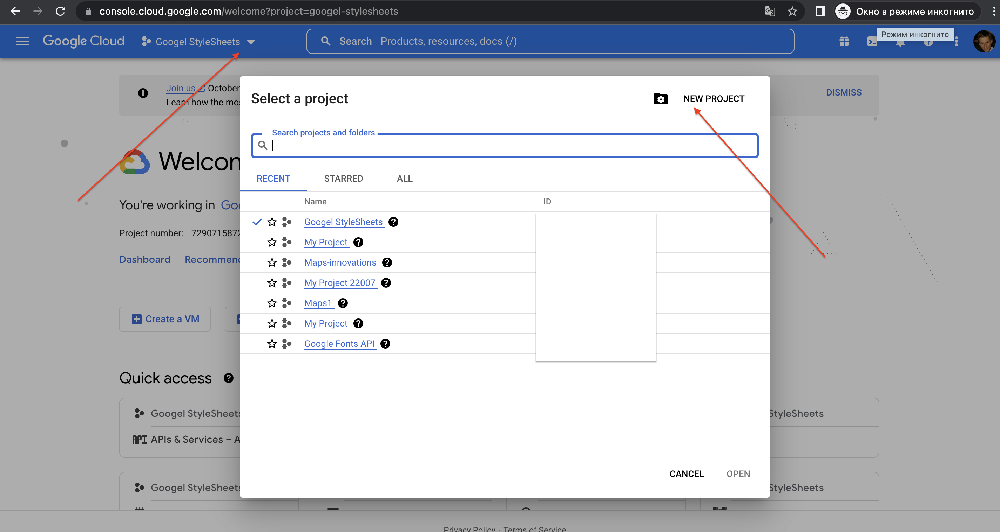  
  
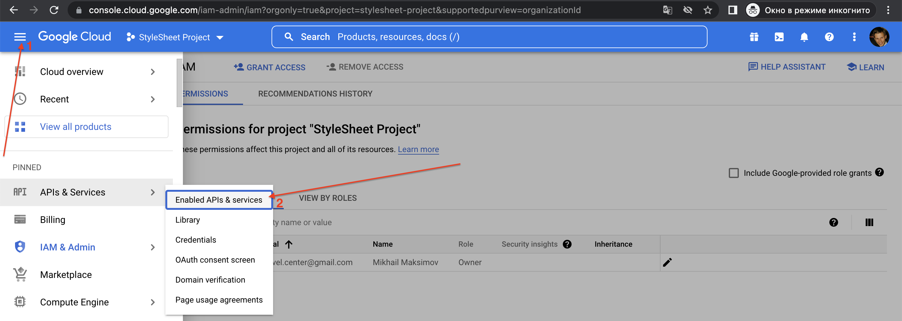  
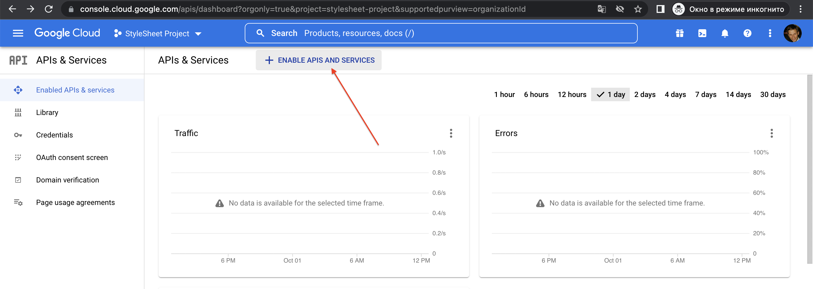  
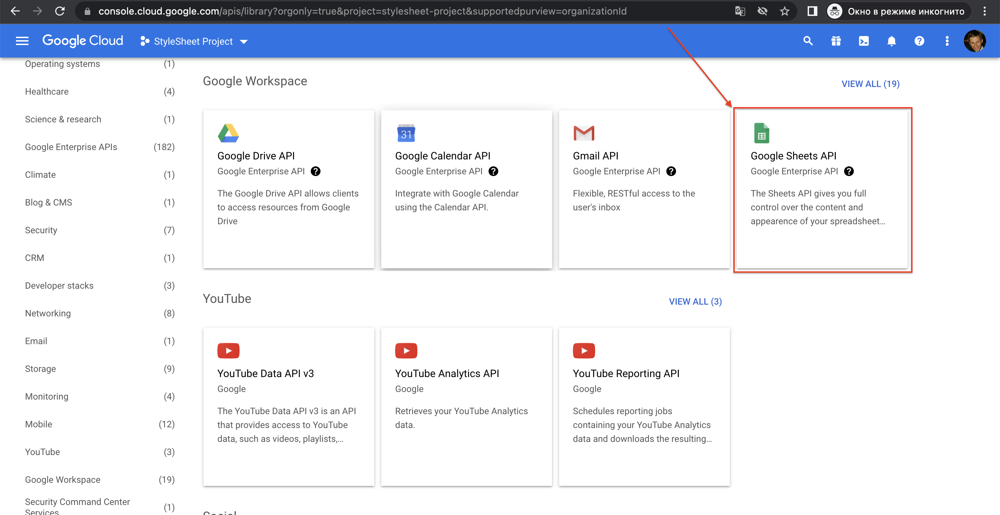  
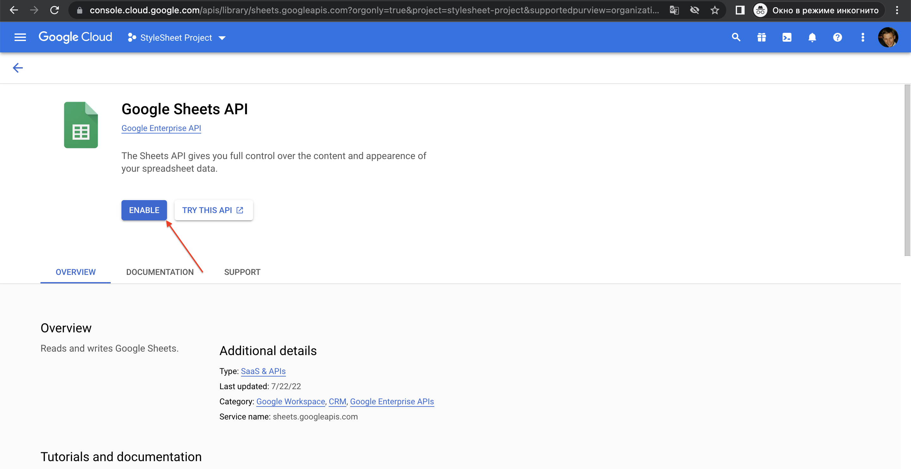  
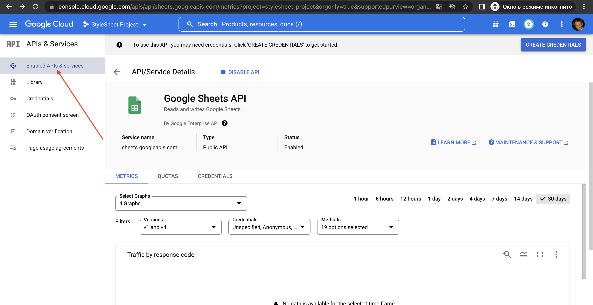  
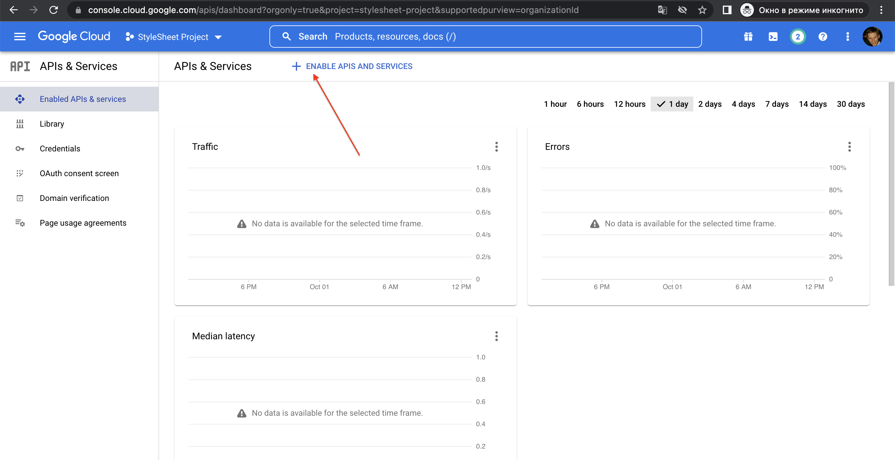  
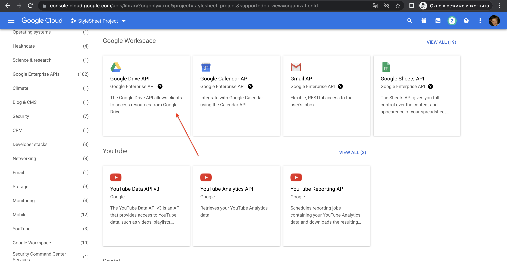  
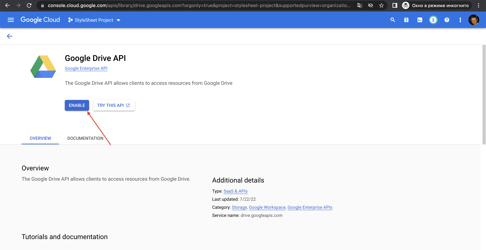  
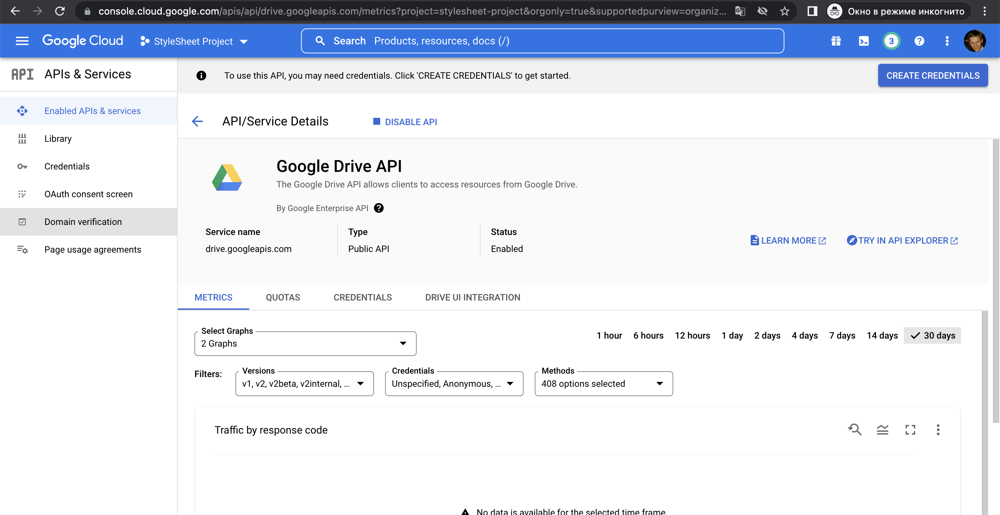  
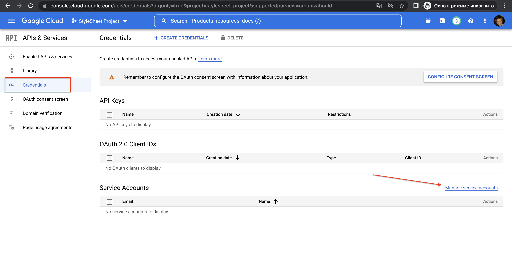  
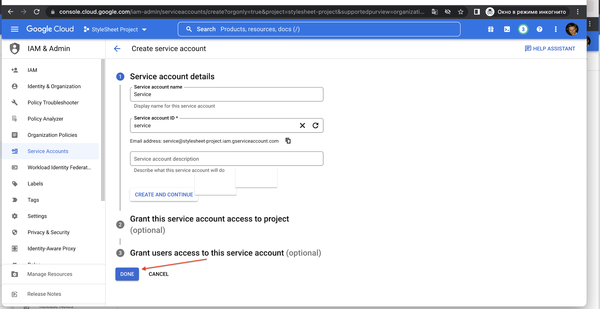  
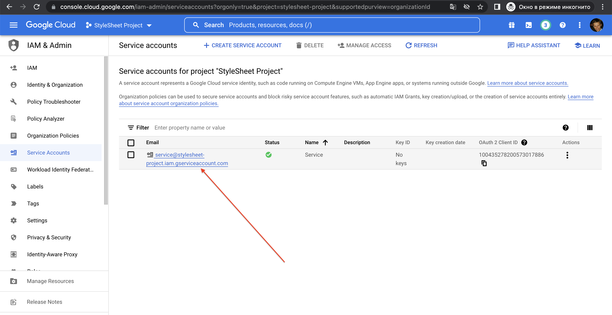  
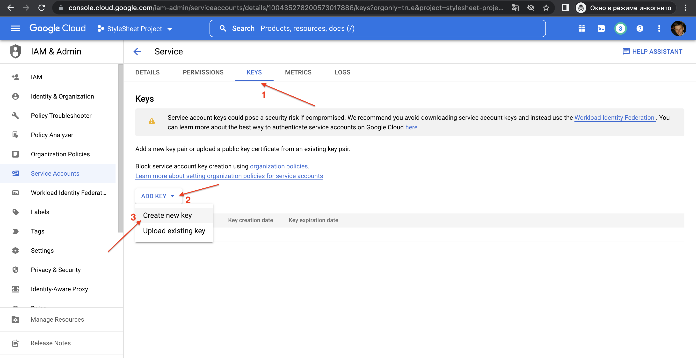  
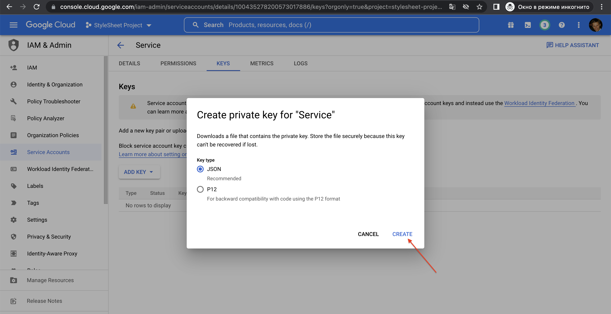  
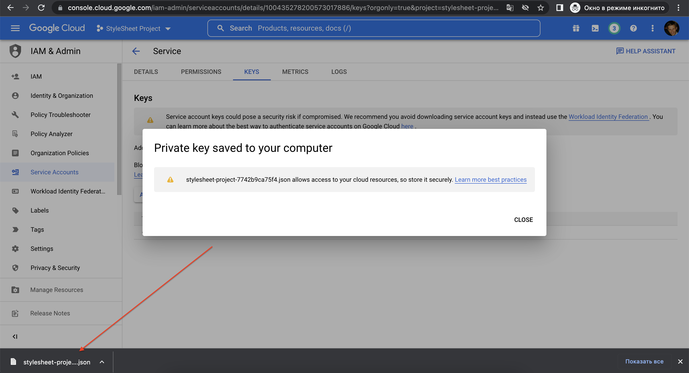  