# Робота із API Google stylesheet.
Для початку роботи із Google Stylesheet треба зареєструватися в <a href = "https://console.cloud.google.com/" tagret = "_blank">Google Developer Console</a>
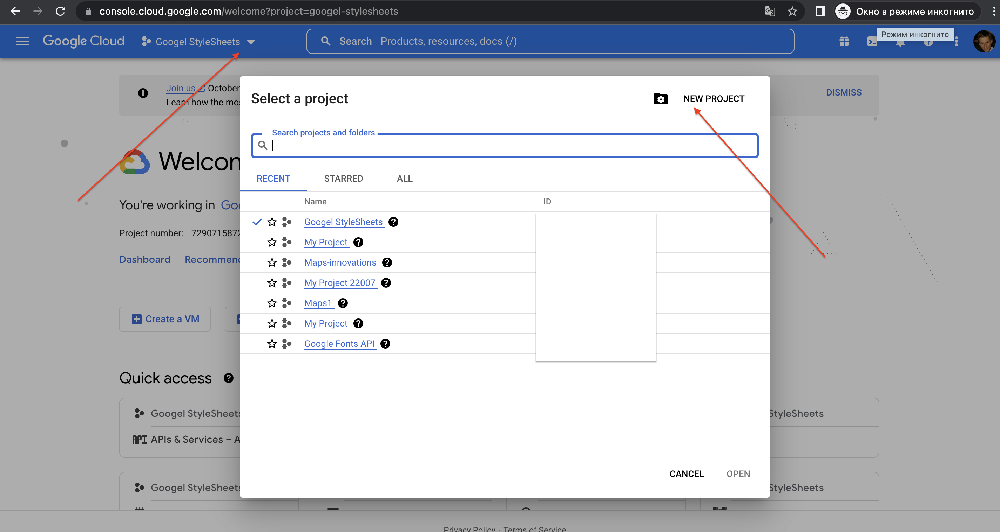  
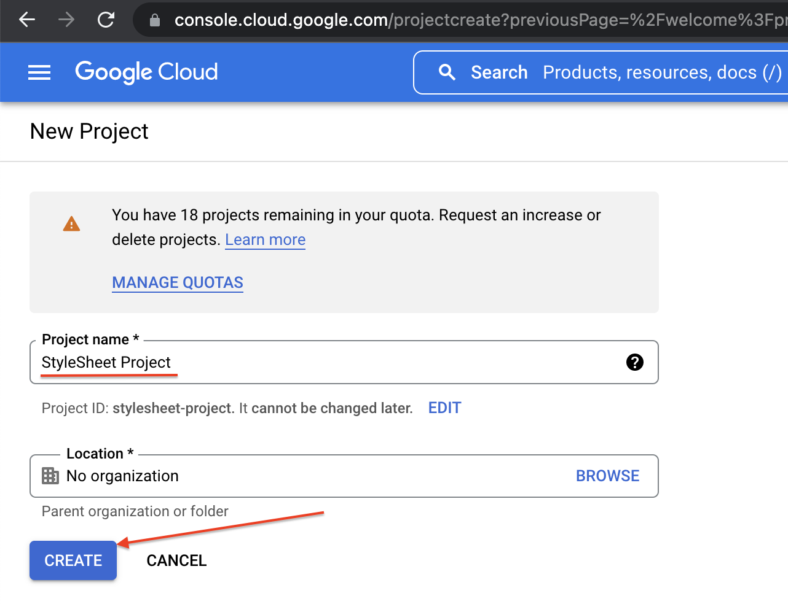  
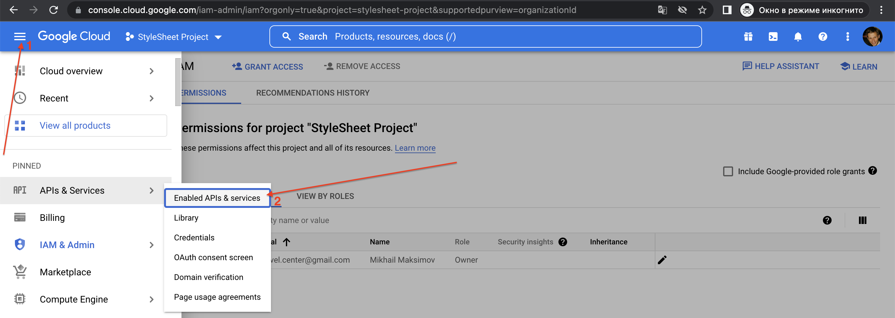  
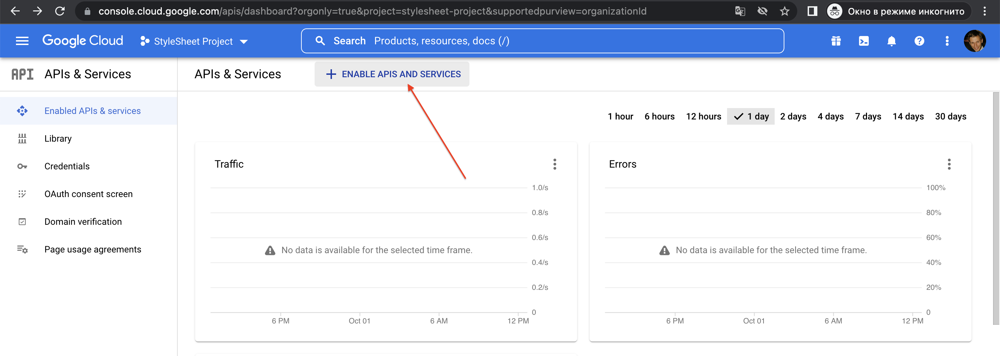  
  
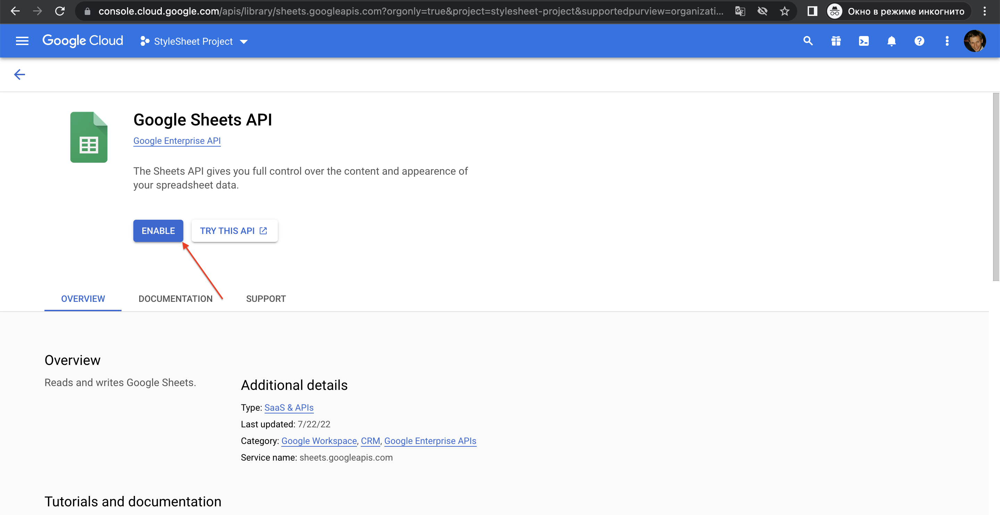  
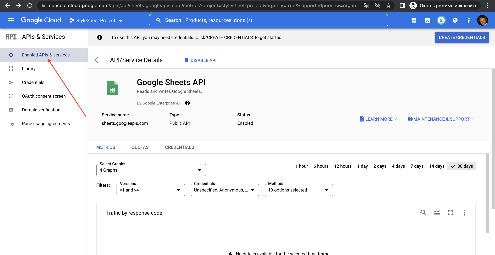  
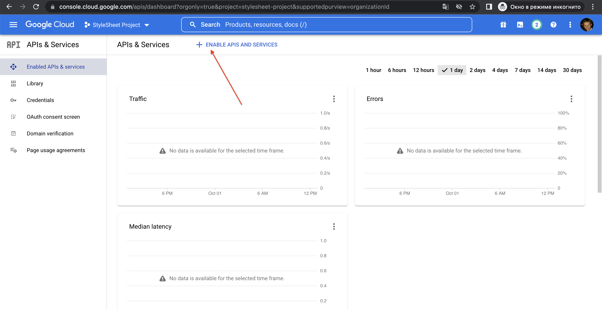  
  
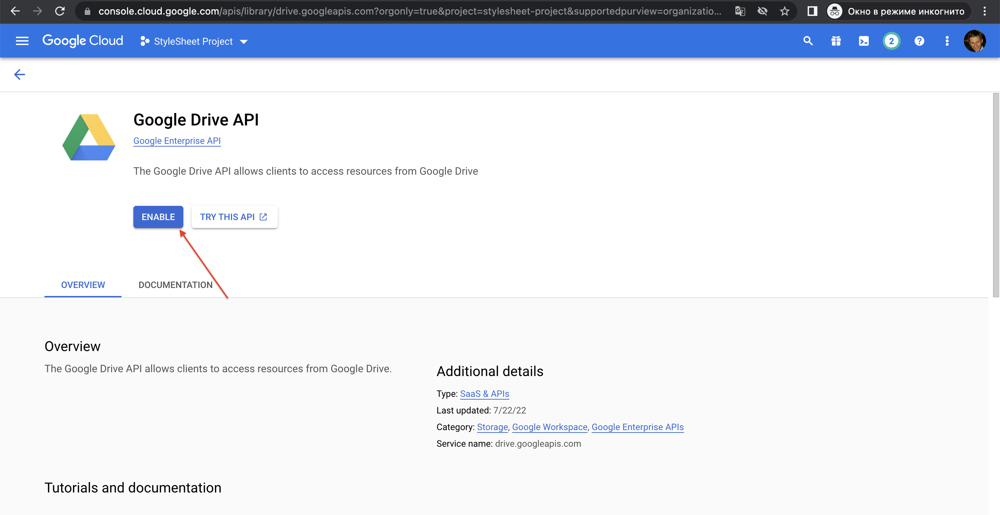  
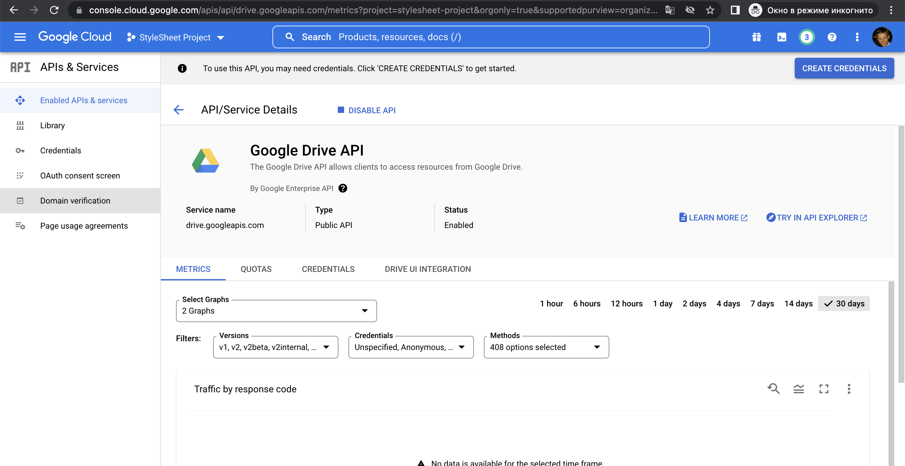  
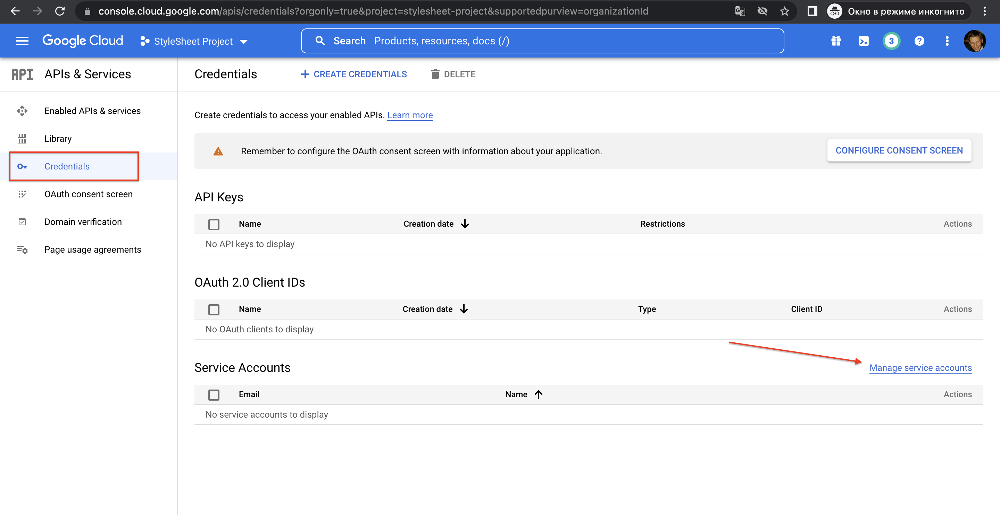  
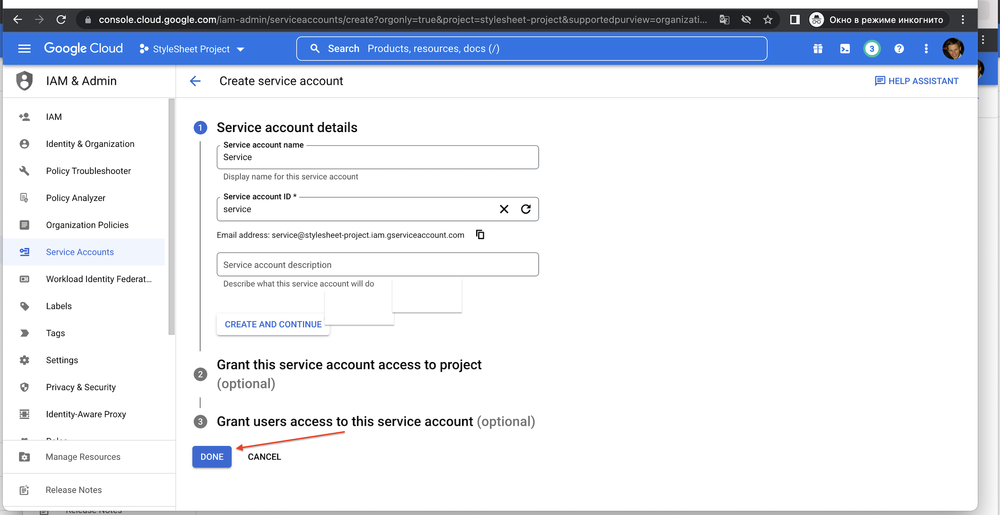  
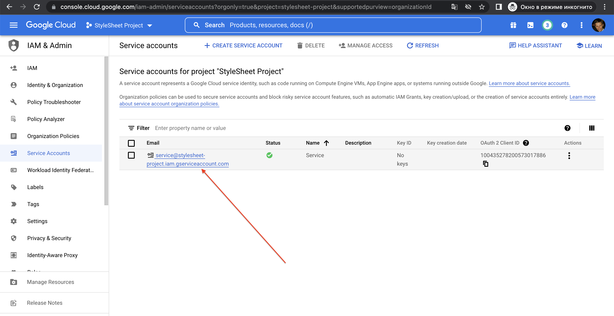  
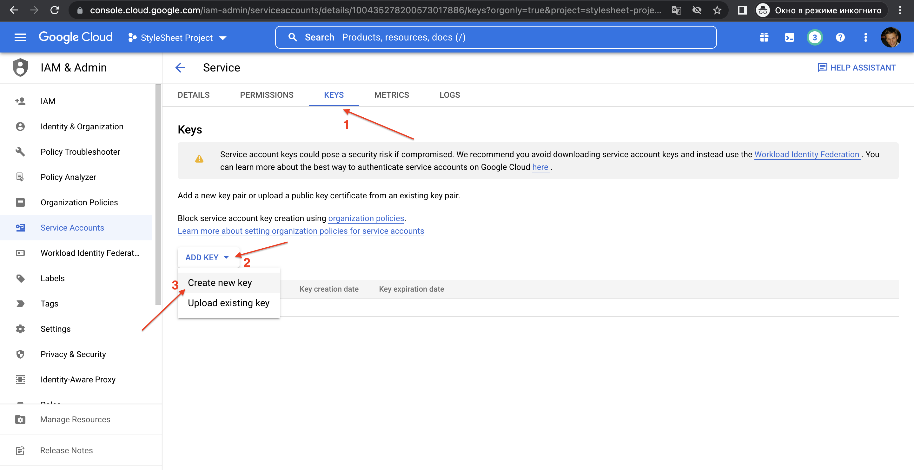  
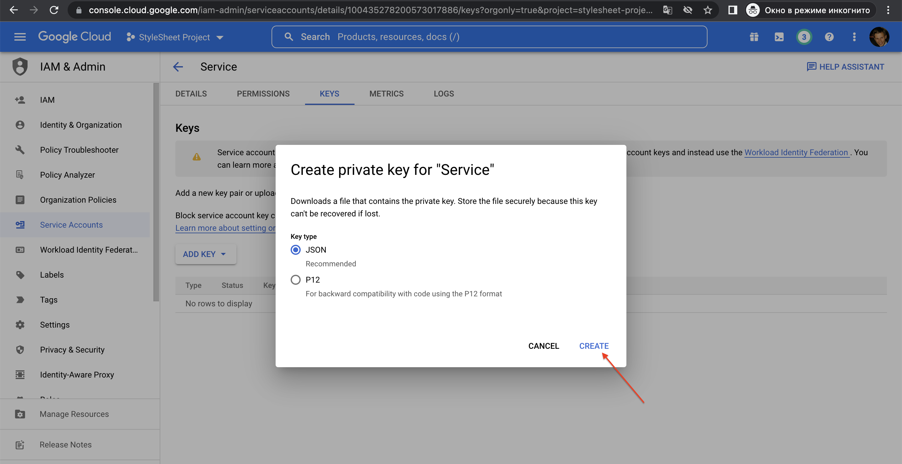  
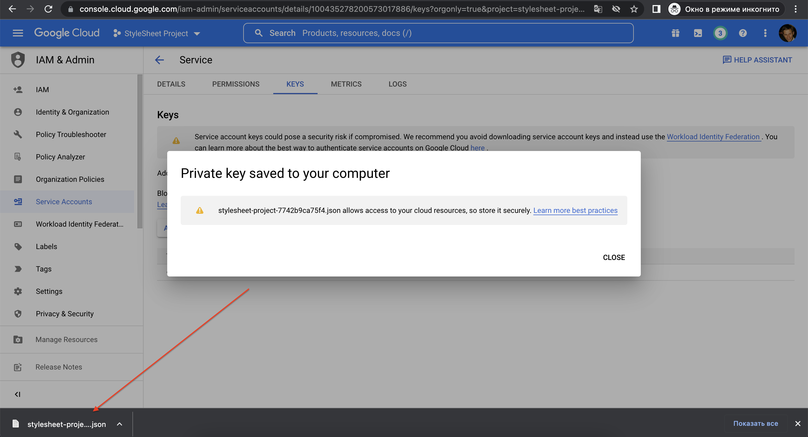  

## Внесення значень ячійок в електорнній таблиці
1. Створимо новий документ.

  
  

2. Змінимо назву документу
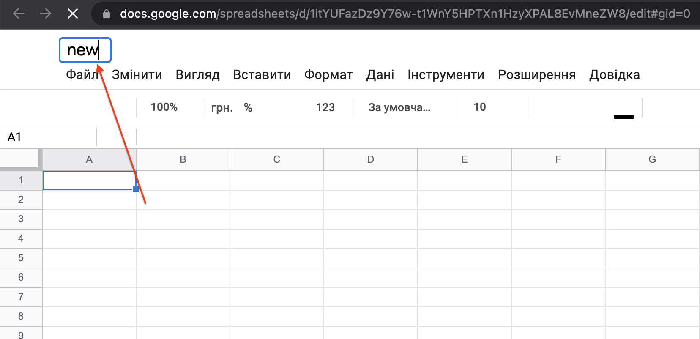  

3. Відкриємо доступ до документа
  
  
  

4. Отримаємо ідентифікатор
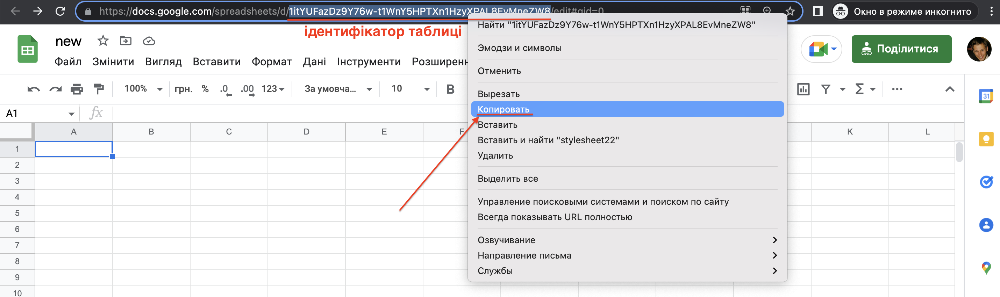  

5. Робимо посилання на файл, підставляємо ідентифікатор
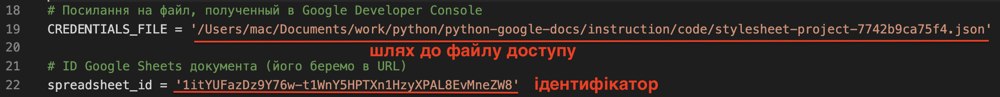  

```python

from __future__ import print_function

from pprint import pprint

import httplib2
import apiclient.discovery
from oauth2client.service_account import ServiceAccountCredentials

import os.path

from google.auth.transport.requests import Request
from google.oauth2.credentials import Credentials
from google_auth_oauthlib.flow import InstalledAppFlow
from googleapiclient.discovery import build
from googleapiclient.errors import HttpError


# Посилання на файл, полученный в Google Developer Console
CREDENTIALS_FILE = '/Users/mac/Documents/work/python/python-google-docs/instruction/code/stylesheet-project-7742b9ca75f4.json'

# ID Google Sheets документа (його беремо в URL)
spreadsheet_id = '1itYUFazDz9Y76w-t1WnY5HPTXn1HzyXPAL8EvMneZW8'

# Авторизуємося и та отримаємо service — екзепляр доступу до API
credentials = ServiceAccountCredentials.from_json_keyfile_name(
    CREDENTIALS_FILE,
    ['https://www.googleapis.com/auth/spreadsheets',
     'https://www.googleapis.com/auth/drive'])
httpAuth = credentials.authorize(httplib2.Http())
service = apiclient.discovery.build('sheets', 'v4', http = httpAuth)

# Задаємо команду, котора в проміжок A1:A2 додає значення "Ячійка А1" та "Ячійка A2" та виконуємо
values = service.spreadsheets().values().batchUpdate(
    spreadsheetId=spreadsheet_id,
    body={
        "valueInputOption": "USER_ENTERED",
        "data": [
            {"range": "A1:A2",
             "majorDimension": "COLUMNS",
             "values": [["Ячійка А1","Ячійка A2"]]}  
	]
    }
).execute()

```

6. Запускаємо файл та отримаємо результати
